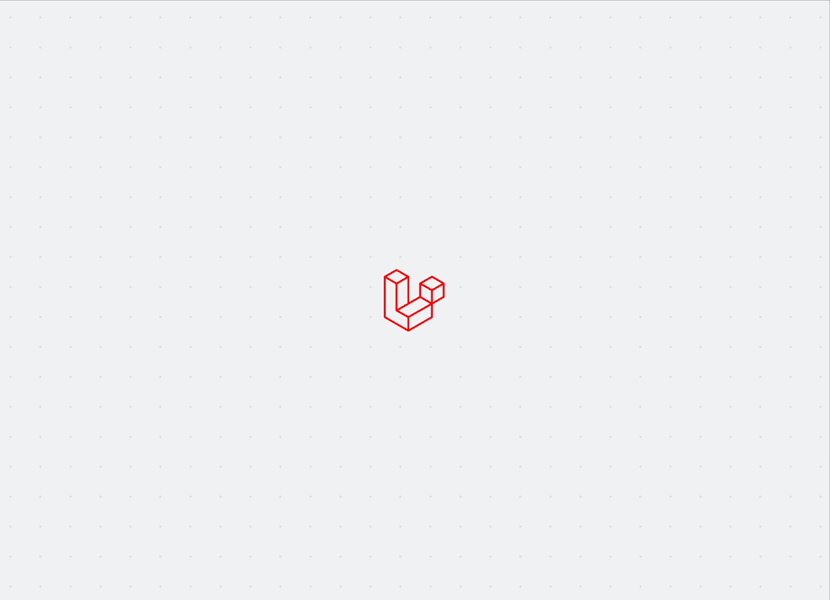

# Vanilla Cookie Consent

Vanilla PHP port of [whitecube/laravel-cookie-consent](https://github.com/whitecube/laravel-cookie-consent)

---

> ✅ 100% GDPR compliant  
> ✅ Fully customizable  
> ✅ Works with and without JS

Under the [EU’s GDPR](http://ec.europa.eu/ipg/basics/legal/cookies/index_en.htm#section_2), cookies that are not strictly necessary for the basic function of your website must only be activated after your end-users have given their explicit consent to the specific purpose of their operation and collection of personal data. Despite some crazy arbitrary requirements decided by non-technical lawmakers, overall **this is a good thing** since it pushes our profession to a more respectful and user-friendly direction. More and more non-EU citizens are expecting websites to ask for their consent, potentially including your website's target audience too.

This package provides all the tools you'll need to cover a proper EU-compliant cookies policy:

- Cookies registration & configuration
- Blade views & translation files for consent alerts & pop-ups
- Blade directives & Facade methods making your life easier
- JavaScript code that will enhance front-end user experience

We've built this package with flexibility in our mind: you'll be able to customize content, behavior and styling as you wish. Here is what it looks like out of the box:



## Table of contents

1. [Installation](#installation)
2. [Usage](#usage)
3. [Configuration](#configuration)
    - [Config options](#config-options)
    - [Translation options](#translations-options)
3. [Registering cookies](#registering-cookies)
    - [Choosing a cookie category](#choosing-a-cookie-category)
    - [Cookie definition](#cookie-definition)
4. [Checking for consent](#checking-for-consent)
5. [Customization](#customization)
    - [The views](#the-views)
    - [Styling](#styling)
    - [Javascript](#javascript)
    - [Textual content and translations](#textual-content-and-translations)
6. [A few useful tips](#a-few-useful-tips)
    - [Cookie Policy Details Page](#cookie-policy-details-page)
    - [Let your users change their mind](#let-your-users-change-their-mind)
    - [Storing user preferences for multiple sub-domains](#storing-user-preferences-for-multiple-sub-domains)
    - [Keep it accessible](#keep-it-accessible)

## Installation

```bash
composer require jszdavid/vanilla-cookie-consent
```

## Usage

First, boot the cookie manager:

```php
use JSzD\VanillaCookieConsent\Cookies;

Cookies::boot();
```

You can configure the package by passing a config array to the `boot()` method:
For the full list of available options see the [configuration](#configuration) section.

```php
use JSzD\VanillaCookieConsent\Cookies;

Cookies::boot(config: $config);
```

Now, we'll have to configure the used cookies:

```php
use JSzD\VanillaCookieConsent\Cookies;

// Register the session cookie under the "required" cookies section:
Cookies::essentials()
    ->session()
    ->csrf();

// Register all Analytics cookies at once using one single shorthand method:
Cookies::analytics()
    ->google(
        id: config('cookieconsent.google_analytics.id')
        anonymizeIp: config('cookieconsent.google_analytics.anonymize_ip')
    );

// Register custom cookies under the pre-existing "optional" category:
Cookies::optional()
    ->name('darkmode_enabled')
    ->description('This cookie helps us remember your preferences regarding the interface\'s brightness.')
    ->duration(120)
    ->accepted(fn(Consent $consent, MyDarkmode $darkmode) => $consent->cookie(value: $darkmode->getDefaultValue()));
```

More details on the available [cookie registration](#registering-cookies) methods below.

Then, let's add consent scripts and modals to the application's views using the following methods:

- `Cookies::renderScripts()`: used to add the package's default JavaScript and any third-party scripts you need to get the end-user's consent for.
- `Cookies::renderViews()`: used to render the alert or pop-up view.

```php
<!DOCTYPE html>
<html lang="en">
<head>
    <!-- ... -->
    <?=\JSzD\VanillaCookieConsent\Cookies::renderView()?>
</head>
<body>
    <!-- ... -->
    <?=\JSzD\VanillaCookieConsent\Cookies::renderScripts()?>
</body>
</html>
```

Finally, handle the routes:
```php
use JSzD\VanillaCookieConsent\Http\Controllers\ResetController;
use JSzD\VanillaCookieConsent\Http\Controllers\ScriptController;
use JSzD\VanillaCookieConsent\Http\Controllers\AcceptAllController;
use JSzD\VanillaCookieConsent\Http\Controllers\ConfigureController;
use JSzD\VanillaCookieConsent\Http\Controllers\AcceptEssentialsController;

/* ... */

// Basic example of a route handling the consent API requests:
switch($_SERVER['REQUEST_URI']) {
    case '/cookie-consent/script': 
        ScriptController::handleRequest();
    case '/cookie-consent/accept-all': 
        AcceptAllController::handleRequest();
    case '/cookie-consent/accept-essentials': 
        AcceptEssentialsController::handleRequest();
    case '/cookie-consent/configure': 
        ConfigureController::handleRequest();
    case '/cookie-consent/reset': 
        ResetController::handleRequest();
}
```

## Configuration

You can configure the package through `boot()` method:
```php
Cookies::boot(config: $config, translations: $translations, locale: $appLocale);
```

- `config`: an array of configuration options.
- `translations`: an array of translations.
- `locale`: the app's locale.

`config` and `translations` not require full configuration. Partial overwrites are also possible. ex.
```php
Cookies::boot(config: ['cookie' => ['name' => 'my_cookie_name']]);
```

### Config options

See [configuration](configuration.md) for a list of all available configuration keys and their default values.


### Translations options

See [/resources/lang/en/cookies.php](/resources/lang/en/cookies.php) for a list of all available translations keys.

## Registering cookies

This package aims to centralize cookie declaration and documentation at the same place in order to keep projects maintainable. However, the suggested methodology is not mandatory. If you wish to queue cookies or execute code upon consent somewhere else in your app's codebase, feel free to do so: we have a few available methods that can come in handy when you'll need to [check if consent has been granted](#checking-for-consent) during the request's lifecycle.

### Choosing a cookie category

All registered cookies are attached to a Cookie Category, which is a convenient way to group cookies under similar topics. The aimed objective is to add usability to the detailed information views by providing understandable and summarized sections.

Instead of consenting each cookie individually, users grant consent to those categories. All cookies included in such a consented category will automatically be considered as given explicit consent to.

There are 3 base categories included in this package:

1. `Cookies::essentials()`: lists all cookies that add required functionality to the app. This category cannot be opted-out and automatically contains the package's consent cookie.
    - `Cookies::essentials()->session()`: registers Laravel's "session" cookie (defined in your app's `session.cookie` configuration) ;
2. `Cookies::analytics()`: lists all cookies used for statistics and data collection.
    - `Cookies::analytics()->google(string $trackingId, bool $anonymizeIp)`: automatically lists all Google Analytics' cookies. **This will also automatically register Google Analytics' JS scripts and inject them to the layout's `<head>` only when consent is granted.** Convenient, huh?
3. `Cookies::optional()`: lists all cookies that serve some kind of utility feature. Since this category can ben opted-out, linked features should always check if consent has been granted before queuing or relying on their cookies.

You are free to add as many custom categories as you want. To do so, simply call the `category(string $key, ?Closure $maker = null)` method on the `Cookies` facade:

```php
use JSzD\VanillaCookieConsent\Cookies;

$category = Cookies::category(key: 'my-custom-category');
```

The optional second parameter, `Closure $maker`, can be used to define a custom `CookiesCategory` instance:

```php
use JSzD\VanillaCookieConsent\Cookies;

$category = Cookies::category(key: 'my-custom-category', maker: function(string $key) {
    return new MyCustomCategory($key);
});
```

Custom category classes should extend `JSzD\VanillaCookieConsent\CookiesCategory`.

Once defined, custom categories can be accessed using their own camel-case method:

```php
use JSzD\VanillaCookieConsent\Cookies;

$category = Cookies::myCustomCategory();
```

In order to add human-readable titles and descriptions to categories, you should insert new lines to the `categories.[category-key]` translations. More information on [translations](#textual-content-and-translations) below.

```php
[
    // ...
    'categories' => [
        // ...
        'my-custom-category' => [
            'title' => 'My custom category of cookies',
            'description' => 'A short description of what these cookies are meant for.',
        ],
        // ...
    ],
];
```

### Cookie definition

Once a category has been targetted, you can start defining cookies in it using the following methods:

```php
Cookies::essentials()               // Targetting a category
    ->name('darkmode_enabled')      // Defining a cookie
    ->description('Lorem ipsum')    // Adding the cookie's description for display
    ->duration(120);                // Adding the cookie's lifetime in minutes
```

Using these methods you'll have to define each cookie by calling a category each time. For convenience it is also possible to chain cookie definitions using the chainable `cookie(Closure|Cookie $cookie)` method:

```php
use JSzD\VanillaCookieConsent\Cookies;

Cookies::essentials()               // Targetting a category
    ->cookie(function(Cookie $cookie) {
        $cookie->name('darkmode_enabled')       // Defining a cookie
            ->description('Lorem ipsum')        // Adding the cookie's description for display
            ->duration(120);                    // Adding the cookie's lifetime in minutes
    })
    ->cookie(function(Cookie $cookie) {
        $cookie->name('high_contrast_enabled')  // Defining a cookie
            ->description('Lorem ipsum')        // Adding the cookie's description for display
            ->duration(60 * 24 * 365);          // Adding the cookie's lifetime in minutes
    });
```

#### `name(string $name)`

Required. Defines the cookie name. It is used for display and as the actual cookie "key" when setting the cookie.

#### `description(string $description)`

Optional. Adds a textual description for the cookie. It is used for display only.

#### `duration(int $minutes)`

Required. Defines the cookie's lifetime in minutes. It is used for display and for the actual cookie expiration date when setting the cookie.

#### `accepted(Closure $callback)`

The optional "accepted" callback gets invoked when consent is granted to the category a cookie is attached to. This happens once the user configures their cookie preferences but also each time an incoming request is handled afterwards.

The callback receives at least one parameter, `Consent $consent`, which is an object used to configure consent output:

- `script(string $tag)`: defines a script tag that will be added to the layout's `<head>` only when consent has been granted ;
- `cookie(string $value, ?string $path = null, ?string $domain = null, ?bool $secure = null, bool $httpOnly = true, bool $raw = false, ?string $sameSite = null)`: defines a cookie that will be added to the response when consent has been granted. Note that it doesn't need a name and a duration anymore since those settings have already been defined using the `name()` and `duration()` methods described above.
```php
use JSzD\VanillaCookieConsent\Consent;

$cookie->accepted(function(Consent $consent) {
    $consent->cookie(value: 'off')->script('<script src="' . asset('js/darkmode.js') . '"></script>');
});
```

Other parameters can be type-hinted and will be resolved by Laravel's Service Container:

```php
use App\Services\MyDependencyService;
use JSzD\VanillaCookieConsent\Consent;

$service = new MyDependencyService();

$cookie->accepted(function(Consent $consent) use ($service) {
    $consent->script($service->getScriptTag());
});
```

#### Custom cookie attributes

When building your own cookie notice designs, you might need extra attributes on the `Cookie` instances. We've got you covered!

```php
$cookie->color = 'warning';

echo $cookie->color; // "warning"
```

Behind the scenes, these magic attributes use the `setAttribute` and `getAttribute` methods:

```php
$cookie->setAttribute('icon', 'brightness');

echo $cookie->getAttribute('icon'); // "brightness"
```

But since all other cookie definition methods are chainable, you can also call custom attributes as chainable methods:

```php
$cookie->subtitle('Darkmode preferences')->checkmark(true);

echo $cookie->subtitle; // "brightness"
echo $cookie->checkmark ? 'on' : 'off'; // "on"
```

## Checking for consent

You can check for explicit user consent the following way:

```php
use JSzD\VanillaCookieConsent\Cookies;

if(Cookies::hasConsentFor('my_cookie_name')) {
    // ...
}
```

## Customization

Cookie notices are boring and this package's default design is no different. It has been built in a robust, accessible and neutral way so it could serve as many situations as possible.

However, this world shouldn't be a boring place and even if cookie notices are part of a project's legal requirements, why not use it as an opportunity to bring a smile to your audience's face? Cookie modals are now integrated in every digital platform's user experience and therefore they should blend in accordingly: that's why we've built this package with full flexibility in our mind.

### The views

A good starting point is to take a look at this package's default markup, and copy them into your app's files.

Here you can express your unlimited creativity and push the boundaries of conventionnal Cookie notices or popups.

When rendered, the view has access to these variables:

- `$policy`: the URL to your app's Cookie Policy page when defined. To do so, take a look at the package's `cookieconsent.php` configuration file.
- `$cookies`: the registered cookie categories with their attached cookie definitions.

In order to add buttons, we'd recommend using the package's `Cookies::renderButton()` method:

- `Cookies::renderButton('accept.all')`: renders a button targetting this package's "consent to all cookies" API route ;
- `Cookies::renderButton('accept.essentials')`: renders a button targetting this package's "consent to essential cookies only" API route ;
- `Cookies::renderButton('accept.configuration')`: renders a button targetting this package's "consent to custom cookies selection" API route. Beware that this route requires the selected cookie categories as the request's payload ;
- `Cookies::renderButton('reset')`: renders a button targetting this package's "reset cookie configuration" API route.

Don't forget to overwrite the `views_dir` to use your own views.

```php
Cookies::boot(config: ['views_dir' => 'path-to-my-views-dir']);
```

### Styling

As you probably noticed, we've included our design's CSS directly in the `cookies.blade.php` view using a `<style>` tag. You can move, remove or replace it if needed. In fact, we'd recommend adding your own styles using a proper CSS file loaded in the layout's `<head>` using a `<link>` tag or by adding Tailwind classes to the HTML markup.

Our CSS file included in this package's `resources/css` directory. If that fits your workflow, feel free to use it as a starting point for your own implementation.

Buttons in this package are designed to be easily customizable.  
You can pass an array of attributes directly to the `Cookies::renderButton()` method:

```php
Cookies::renderButton(
    action: 'reset',
    label: 'Manage cookies',
    attributes: [
        'id' => 'reset-button',
        'class' => 'btn'
    ]
);
```

In this example:

* The wrapping `<form>` element will receive the `btn` class.
* The generated `<button>` itself will always have the `__link` added to the form class.

With this setup, you can freely customize your button styles using pseudo-classes like `:hover`, `:focus`, while keeping a clean and maintainable structure.

For other changes, don't forget [you can overwrite the package's views](#the-views).

### Javascript

Keep in mind that cookie notices are supposed to work when Javascript is disabled. This package's base design only uses Javascript as an extra layer for a smoother User Experience, but its features do not rely on it.

Since most implementations have the same needs, we've separated our Javascript code into two parts:

1. A reusable Javascript library: automatically loaded via the `Cookies::renderScripts()` method, it is used to perform AJAX requests (using Axios) for all the existing API routes:
    - `LaravelCookieConsent.acceptAll()`
    - `LaravelCookieConsent.acceptEssentials()`
    - `LaravelCookieConsent.configure(data)`
    - `LaravelCookieConsent.reset()`
2. A script implementing said library for our base design. Like our basic styling tag, this script is directly included in the `cookies.php` view using a `<script>` tag. Feel free to remove it and add your own interactivity logic.

### Textual content and translations

Most of the displayed strings are defined in the [/resources/lang](/resources/lang) translation files. The package ships with a few supported locales, but if yours is not yet included we would greatly appreciate a PR.

You can partially or fully overwrite the translations by passing an array of translations to the `boot()` method:
```php
Cookies::boot(translations: [/*...*/]);
```
This bypasses, for the provided keys, the package's default translations and the set locale;

You can also provide custom translation files to the `boot()` method:
```php
Cookies::boot(config: ['lang_dir' => 'path-to-my-lang-dir']);
```
This directory should follow the same structure as the package's, `/{lang_code}/cookies.php`;

When using a custom directory, the package will look for the translations in the following order:
1. The `translations` array provided to the `boot()` method.
2. The user specified translations directory.
3. The package's default translations directory.

> Note that the package does this for the set locale, so you can provide translation files for only a selected of languages, and the package will still use the default translations for the rest. 

## A few useful tips

> **Disclaimer**: We are not lawyers. Always check with your legal partners which rules may apply to your project.

### Cookie Policy Details Page

Your website will need a dedicated "Cookie Policy" page containing extensive information about cookies, how and why they're used, etc. These pages also explain in detail which cookies are included. In order to keep these pages automatically up-to-date, keep in mind that this package can be used anywhere in your application using the `Whitecube\LaravelCookieConsent\Facades\Cookies` facade:

```php
<?php ?>
<h1>Cookie Policy</h1>

<p>...</p>

<h2>How do we use cookies?</h2>

<?php foreach(Cookies::getCategories() as $category)?>
<table>
    <caption><?=$category->title?></caption>
    <thead>
        <tr>
            <th>Cookie</th>
            <th>Description</th>
            <th>Duration</th>
        </tr>
    </thead>
    <tbody>
        <?php foreach($category->getCookies() as $cookie)?>
        <tr>
            <td><?= $cookie->name ?></td>
            <td><?= $cookie->description ?></td>
            <td><?= \Carbon\Carbon::now()->diffForHumans(\Carbon\Carbon::now()->addMinutes($cookie->duration), true) ?></td>
        </tr>
        <?php endforeach; ?>
    </tbody>
</table>
<?php endforeach; ?>

<p>...</p>
```

### Let your users change their mind

Users should be able to change their consent settings at any time. No worries, with this package it is quite simple to achieve: generate a button that will reset the user's cookies and show the consent modal again.

```php
Cookies::renderButton('reset')
```

This will output a fully functional consent reset button. If you wish to customize it, you can pass it the following parameters:

```php
Cookies::renderButton(action: 'reset', label: 'Manage cookies', attributes: ['id' => 'reset-button', 'class' => 'btn'])
```

Or, for even more customization, you can change its template in `button.blade.php` (you'll have to copy the package's views first). Keep in mind that this template is used for all button components in this package, including the "Accept all", "Accept essentials" and "Save configuration" buttons.

If you're wondering why these buttons are wrapped in a `form` element: this way they'll work when JavaScript is disabled whilst preventing browser link prefetching.

### Storing user preferences for multiple sub-domains

By default, this package will store the user's preferences for the current domain. If you wish to prompt for consent only once and keep the user's choice across multiple sub-domains, you'll have to configure the `cookie.domain` setting as follows:

```php
Cookies::boot(config: [
    // ...
   'cookie' => [
       // ...
       'domain' => '.mydomain.com', // notice the leading "."
   ],
    // ...
]);
```

### Injecting the cookies inside a legal page

To provide detailed cookie information within a legal page, such as a terms of service or privacy policy page, you can inject a formatted table listing cookie names, descriptions, and durations.

This can be done using the `Cookies::renderInfo()` method, or you can place the directive directly within a WYSIWYG editor and later replace it using the following method:
```php
{!! Cookies::replaceInfoTag($wysiwyg) !!}
```
This will automatically generate and insert the required cookie information, ensuring your legal documentation remains up-to-date and compliant.


### Keep it accessible

When defining your own views & styles, keep in mind that cookie notices are obstacles for the application's overall accessibility. Also, they should work even when JavaScript is not enabled, that's why this package mainly works using API routes and AJAX calls in order to enhance user experience.

---

## Contributing

Feel free to suggest changes, ask for new features or fix bugs yourself. We're sure there are still a lot of improvements that could be made, and we would be very happy to merge useful pull requests. Thanks!
